## 1\. Understanding Pods as the Smallest Deployable Unit

### What Exactly Is a Pod?

A Pod is Kubernetes' atomic unit of deployment. You cannot deploy anything smaller than a Pod. While you might think of containers as the fundamental building block (since that's what actually runs your code), Kubernetes wraps containers in Pods for important architectural reasons.

**The Technical Reality:**

When you create a Pod, Kubernetes actually creates something called a **pause container** (also called the infrastructure container) first. This hidden container:

1. Holds the network namespace for the Pod
    
2. Acquires the Pod's IP address
    
3. Stays running for the Pod's entire lifetime
    
4. Allows your application containers to restart without losing network identity
    

Your application containers then join this pause container's namespaces. This is why all containers in a Pod share the same IP address and network stack.

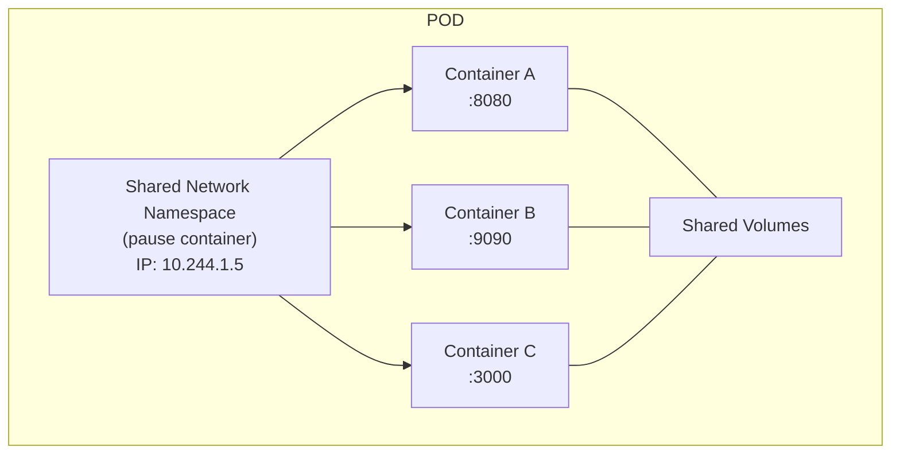

### What Does "Smallest Deployable Unit" Actually Mean?

It means:

1. **Scheduling granularity** — The Kubernetes scheduler places entire Pods on nodes, never individual containers. If you have 3 containers in a Pod, they all go to the same node together.
    
2. **Scaling granularity** — When you scale up, you add more Pods, not more containers within a Pod. If you need 5 replicas of your web server, you get 5 Pods, each with its own web server container.
    
3. **Failure granularity** — If a node fails, the entire Pod fails. Kubernetes doesn't try to relocate individual containers from a Pod to different nodes.
    

### Why Not Deploy Containers Directly?

Consider what you'd need to manage if Kubernetes deployed raw containers:

* **Networking:** How would containers find each other? How would they share [localhost](http://localhost)?
    
* **Storage:** How would you share files between containers?
    
* **Lifecycle:** What happens when one container depends on another?
    
* **Identity:** How do you refer to a group of related containers as one thing?
    

The Pod abstraction solves all of these:

| Problem | Pod Solution |
| --- | --- |
| Containers need same IP | Pod provides shared network namespace |
| Containers need shared files | Pod provides shared volume mounts |
| Containers have dependencies | Init containers and lifecycle hooks |
| Need atomic deployment | Pod is scheduled/deployed as one unit |
| Need health tracking | Pod-level status and conditions |

### The Pod-to-Container Relationship: Real-World Analogy

Imagine shipping containers (the metal boxes on cargo ships). A Pod is like a shipping container, and application containers are like the packages inside it.

* The shipping container (Pod) provides the outer boundary and tracking number
    
* The packages (containers) inside share the same journey
    
* When the shipping container moves, everything inside moves together
    
* The shipping manifest (Pod spec) lists all packages inside
    
* Customs (Kubernetes) deals with shipping containers, not individual packages
    

**When to Use Single-Container Pods:**

Most Pods contain exactly one container. Use single-container Pods when:

* The container is self-sufficient
    
* It doesn't need to share files or network with a helper
    
* Scaling means running more instances of the same thing
    

**When to Use Multi-Container Pods:**

Use multi-container Pods only when containers are **tightly coupled**:

* They must run on the same machine
    
* They must share files
    
* They communicate over [localhost](http://localhost)
    
* They scale together as a unit
    

---

## 2\. Pod Lifecycle and Phases

### The Complete Pod Lifecycle Journey

When you create a Pod, it goes through a predictable sequence of events. Understanding this deeply helps you debug problems.

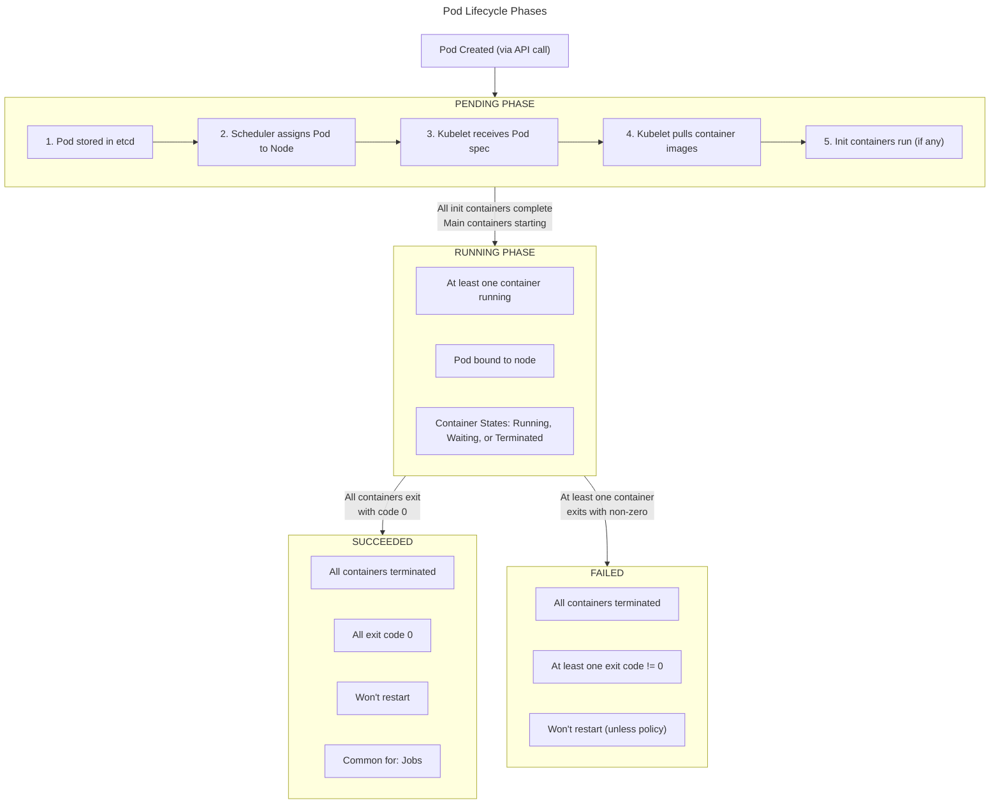

### Deep Dive into Each Phase

#### PENDING Phase

A Pod enters Pending immediately after creation and stays there until containers start running. Many things happen in this phase:

**Step 1: API Server Processing**

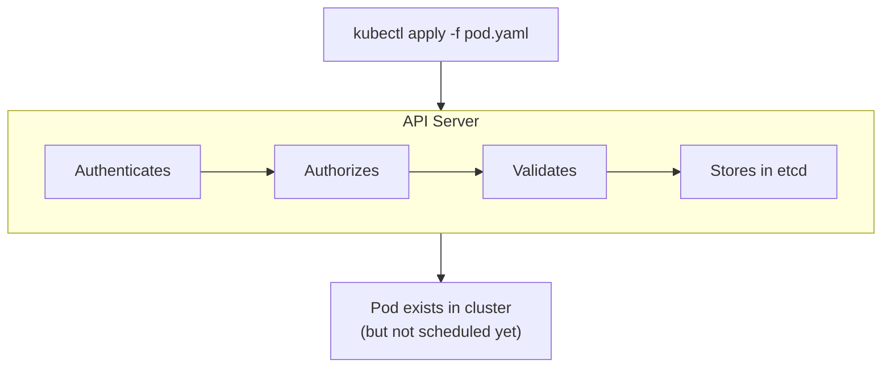

**Step 2: Scheduling**

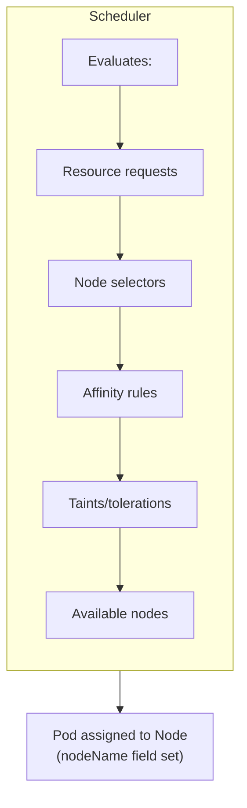

**What Can Cause Prolonged Pending:**

| Symptom | Cause | How to Debug |
| --- | --- | --- |
| No node assigned | No node has enough resources | `kubectl describe pod` shows "Insufficient cpu/memory" |
| No node assigned | No node matches node selector | Check node labels vs pod's nodeSelector |
| No node assigned | Taints blocking all nodes | Check tolerations |
| Image pull stuck | Wrong image name or tag | `kubectl describe pod` shows ImagePullBackOff |
| Image pull stuck | Private registry, no credentials | Check imagePullSecrets |
| Init container running | Init containers taking time | Normal if init does real work |

**Example Pending Debugging:**

```bash
$ kubectl get pods
NAME      READY   STATUS    RESTARTS   AGE
my-pod    0/1     Pending   0          5m

$ kubectl describe pod my-pod
...
Events:
  Type     Reason            Age   From               Message
  ----     ------            ----  ----               -------
  Warning  FailedScheduling  5m    default-scheduler  0/3 nodes are available: 
                                                       3 Insufficient memory.
```

This tells you: No node has enough memory for this Pod's requests.

#### RUNNING Phase

Once at least one main container is running, the Pod transitions to Running. But "Running" doesn't mean "working correctly" — your app could be crashing in a loop.

**Container States Within Running Pod:**

```yaml
# kubectl get pod my-pod -o yaml (simplified)
status:
  phase: Running
  containerStatuses:
  - name: nginx
    state:
      running:
        startedAt: "2024-01-15T10:00:00Z"
    ready: true
    restartCount: 0
  - name: sidecar
    state:
      waiting:
        reason: CrashLoopBackOff
        message: "back-off 5m0s restarting failed container"
    ready: false
    restartCount: 5
```

This Pod is "Running" but has a problem — the sidecar container keeps crashing.

**Container State Details:**

| State | Fields | Meaning |
| --- | --- | --- |
| `waiting` | reason, message | Container not running yet. Reasons: ContainerCreating, ImagePullBackOff, CrashLoopBackOff |
| `running` | startedAt | Container executing. Has timestamp of start |
| `terminated` | exitCode, reason, startedAt, finishedAt | Container finished. exitCode 0 = success, else failure |

#### SUCCEEDED Phase

Pods reach Succeeded when:

* All containers have terminated
    
* All containers exited with code 0
    
* The Pod won't be restarted
    

This is normal for **Jobs** — workloads designed to run to completion:

```bash
$ kubectl get pods
NAME              READY   STATUS      RESTARTS   AGE
backup-job-xyz    0/1     Completed   0          1h
```

#### FAILED Phase

Pods reach Failed when:

* All containers have terminated
    
* At least one container exited with non-zero code
    
* restartPolicy prevents restart (Never or OnFailure with Succeeded)
    

```bash
$ kubectl get pods
NAME            READY   STATUS   RESTARTS   AGE
broken-job-abc  0/1     Error    0          5m

$ kubectl logs broken-job-abc
Error: database connection failed
```

### Restart Policies

The `restartPolicy` field determines what happens when containers exit:

```yaml
spec:
  restartPolicy: Always  # Options: Always, OnFailure, Never
```

| Policy | Behavior | Use Case |
| --- | --- | --- |
| `Always` | Always restart containers, regardless of exit code | Long-running services (web servers, daemons) |
| `OnFailure` | Restart only if exit code is non-zero | Jobs that should retry on failure |
| `Never` | Never restart containers | Jobs where failure should not retry |

**How Restart Backoff Works:**

When a container keeps failing, Kubernetes doesn't just hammer restarts. It uses exponential backoff:

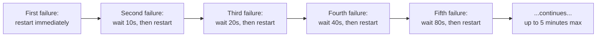

This is why you see "CrashLoopBackOff" — Kubernetes is backing off between restart attempts.

### Pod Conditions

Beyond the simple phase, Pods have detailed **conditions**:

```bash
$ kubectl describe pod my-pod
Conditions:
  Type              Status
  Initialized       True    # All init containers completed
  Ready             True    # Pod is ready to serve traffic
  ContainersReady   True    # All containers are ready
  PodScheduled      True    # Pod has been scheduled to a node
```

| Condition | True Means |
| --- | --- |
| `PodScheduled` | Pod assigned to a node |
| `Initialized` | All init containers completed successfully |
| `ContainersReady` | All containers have passed readiness probes |
| `Ready` | Pod can receive traffic (used by Services) |

---

## 3\. Creating Pods: Imperative vs Declarative

These represent two fundamentally different approaches to managing infrastructure.

### Imperative Approach: Telling Kubernetes What To Do

With imperative commands, you issue direct orders to Kubernetes: "Run this container," "Delete this Pod," "Scale this deployment."

**The Imperative Mindset:**

* You are the operator
    
* You execute commands in sequence
    
* The cluster state is the result of your actions
    
* No record exists of how you got to current state
    

**Basic Pod Creation:**

```bash
kubectl run nginx-pod --image=nginx
```

This single command:

1. Creates a Pod resource
    
2. Names it "nginx-pod"
    
3. Uses the nginx image
    
4. Applies default settings for everything else
    

**Adding More Options:**

```bash
kubectl run nginx-pod \
  --image=nginx:1.19 \
  --port=80 \
  --labels="app=web,env=prod" \
  --env="ENV=production" \
  --restart=Never
```

**Common Imperative Commands:**

| Command | Purpose |
| --- | --- |
| `kubectl run NAME --image=IMAGE` | Create a Pod |
| `kubectl create deployment NAME --image=IMAGE` | Create a Deployment |
| `kubectl expose pod NAME --port=80` | Create a Service |
| `kubectl delete pod NAME` | Delete a Pod |
| `kubectl edit pod NAME` | Edit live resource |
| `kubectl scale deployment NAME --replicas=3` | Scale deployment |

**Imperative Object Configuration:**

There's a middle ground — using imperative verbs with files:

```bash
kubectl create -f pod.yaml    # Create (fails if exists)
kubectl delete -f pod.yaml    # Delete
kubectl replace -f pod.yaml   # Replace (must exist)
```

This is still imperative because you're telling Kubernetes what to do, but you're using files to define the objects.

### Declarative Approach: Telling Kubernetes What You Want

With declarative configuration, you describe the desired state, and Kubernetes figures out how to achieve it.

**The Declarative Mindset:**

* You define the target state
    
* Kubernetes continuously works toward that state
    
* The definition IS the documentation
    
* Changes are tracked through version control
    

**The Core Command:**

```bash
kubectl apply -f pod.yaml
```

`apply` is intelligent:

* If resource doesn't exist → create it
    
* If resource exists → update it to match the file
    
* If resource is unchanged → do nothing
    

**Declarative Workflow:**

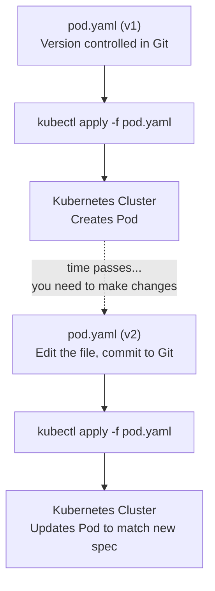

### Comparison Table

| Aspect | Imperative | Declarative |
| --- | --- | --- |
| **Command** | `kubectl run`, `create`, `delete` | `kubectl apply` |
| **State tracking** | None (you remember) | Git history |
| **Repeatability** | Run same commands | Apply same files |
| **Collaboration** | Share commands (error-prone) | Share files (reliable) |
| **Audit trail** | None | Git commits |
| **Rollback** | Remember previous commands | Revert Git commit |
| **Partial updates** | Tricky | Automatic |
| **Learning curve** | Lower | Higher |
| **CKAD exams** | Essential for speed | Required for complex tasks |

### The Secret Weapon: Generating YAML from Imperative Commands

Here's the technique that makes you fast in CKAD:

```bash
kubectl run nginx --image=nginx --dry-run=client -o yaml > pod.yaml
```

**Breaking this down:**

| Flag | Meaning |
| --- | --- |
| `--dry-run=client` | Don't actually create anything; just simulate |
| `-o yaml` | Output the would-be resource as YAML |
| `> pod.yaml` | Redirect output to a file |

**Generated output:**

```yaml
apiVersion: v1
kind: Pod
metadata:
  creationTimestamp: null
  labels:
    run: nginx
  name: nginx
spec:
  containers:
  - image: nginx
    name: nginx
    resources: {}
  dnsPolicy: ClusterFirst
  restartPolicy: Always
status: {}
```

Now you can edit this file to add anything you need (environment variables, volumes, etc.) and apply it.

**More Examples:**

```bash
# Generate Pod with port exposed
kubectl run nginx --image=nginx --port=80 --dry-run=client -o yaml

# Generate Pod with environment variable
kubectl run nginx --image=nginx --env="DB_HOST=mysql" --dry-run=client -o yaml

# Generate Pod that runs a command
kubectl run busybox --image=busybox --dry-run=client -o yaml \
  --command -- sleep 3600

# Generate Pod with resource limits
kubectl run nginx --image=nginx --dry-run=client -o yaml \
  --requests='cpu=100m,memory=128Mi' \
  --limits='cpu=200m,memory=256Mi'
```

---

## 4\. YAML Manifest Structure

### The Four Required Top-Level Fields

Every Kubernetes resource YAML follows this structure:

```yaml
apiVersion: <api-version>   # 1. Which API version
kind: <resource-type>       # 2. What kind of resource
metadata:                   # 3. Resource identification
  # ...
spec:                       # 4. Desired state
  # ...
```

Let's examine each in detail.

### Field 1: apiVersion

This tells Kubernetes which schema to use for parsing this resource. Different resources live in different API groups.

**How to find the right apiVersion:**

```bash
# List all API resources and their versions
kubectl api-resources

# Output (partial):
NAME          SHORTNAMES   APIVERSION   NAMESPACED   KIND
pods          po           v1           true         Pod
deployments   deploy       apps/v1      true         Deployment
services      svc          v1           true         Service
configmaps    cm           v1           true         ConfigMap
secrets                    v1           true         Secret
jobs                       batch/v1     true         Job
cronjobs      cj           batch/v1     true         CronJob
```

**API Version Patterns:**

| Pattern | Example | Meaning |
| --- | --- | --- |
| `v1` | `v1` | Core API group, stable |
| `GROUP/VERSION` | `apps/v1` | Named group, stable |
| `GROUP/v1beta1` | [`networking.k8s.io/v1beta1`](http://networking.k8s.io/v1beta1) | Beta, may change |
| `GROUP/v1alpha1` | [`example.io/v1alpha1`](http://example.io/v1alpha1) | Alpha, experimental |

**Common apiVersions for CKAD:**

| Resource | apiVersion |
| --- | --- |
| Pod, Service, ConfigMap, Secret, PersistentVolume, PersistentVolumeClaim | `v1` |
| Deployment, ReplicaSet, DaemonSet, StatefulSet | `apps/v1` |
| Job, CronJob | `batch/v1` |
| Ingress | [`networking.k8s.io/v1`](http://networking.k8s.io/v1) |
| NetworkPolicy | [`networking.k8s.io/v1`](http://networking.k8s.io/v1) |

### Field 2: kind

The type of resource you're creating. This must match one of Kubernetes' registered resource types.

```yaml
kind: Pod
kind: Deployment
kind: Service
kind: ConfigMap
```

The kind determines what fields are valid in the spec section.

### Field 3: metadata

This section provides the resource's identity and organizational information.

```yaml
metadata:
  name: my-pod                    # Required: unique name within namespace
  namespace: default              # Optional: which namespace (default if omitted)
  labels:                         # Optional: key-value pairs for organization
    app: myapp
    environment: production
    version: v1.2.3
  annotations:                    # Optional: non-identifying metadata
    description: "Main application pod"
    owner: "platform-team@company.com"
    git-commit: "abc123def456"
```

**Understanding Labels:**

Labels are key-value pairs that identify resources. They're used for:

1. **Selection** — Find resources matching criteria
    
2. **Grouping** — Organize resources logically
    
3. **Service routing** — Services use label selectors to find Pods
    

```bash
# Find all pods with label app=myapp
kubectl get pods -l app=myapp

# Find pods matching multiple labels
kubectl get pods -l app=myapp,environment=production

# Find pods where version is NOT v1
kubectl get pods -l 'version!=v1'
```

**Label Best Practices:**

| Label Key | Purpose | Example |
| --- | --- | --- |
| `app` | Application name | `app: frontend` |
| `environment` | Deployment environment | `environment: production` |
| `version` | Application version | `version: v2.1.0` |
| `tier` | Architectural tier | `tier: backend` |
| `team` | Owning team | `team: payments` |

**Understanding Annotations:**

Annotations are for non-identifying information:

```yaml
annotations:
  # Documentation
  description: "Handles user authentication"
  
  # Tooling
  prometheus.io/scrape: "true"
  prometheus.io/port: "9090"
  
  # Audit trail
  kubernetes.io/change-cause: "Update to fix CVE-2024-1234"
  
  # Build information
  build.company.com/git-sha: "abc123"
  build.company.com/pipeline: "main-123"
```

**Labels vs Annotations:**

| Aspect | Labels | Annotations |
| --- | --- | --- |
| Used for selection | Yes | No |
| Character limits | Key: 63, Value: 63 | Key: 253, Value: 256KB |
| Purpose | Identify and group | Store metadata |
| Example use | `app=nginx` | Long JSON config |

### Field 4: spec

This is where you define what you actually want. The structure depends on the `kind` of resource.

**Pod spec structure:**

```yaml
spec:
  # Container definitions (required)
  containers:
  - name: main
    image: nginx
    # ... container-specific settings
  
  # Init containers (optional)
  initContainers:
  - name: init
    image: busybox
  
  # Volume definitions (optional)
  volumes:
  - name: data
    emptyDir: {}
  
  # Pod-level settings
  restartPolicy: Always
  serviceAccountName: default
  nodeName: specific-node  # Manual scheduling
  nodeSelector:            # Node selection by labels
    disktype: ssd
```

### Container Spec Deep Dive

The container definition is the heart of a Pod spec:

```yaml
containers:
- name: nginx                        # Required: container name
  image: nginx:1.19                  # Required: image to run
  
  # Command and arguments
  command: ["/bin/sh"]               # Override ENTRYPOINT
  args: ["-c", "echo hello"]         # Override CMD
  
  # Environment variables
  env:
  - name: DB_HOST
    value: "mysql.default.svc"
  - name: DB_PASSWORD
    valueFrom:
      secretKeyRef:
        name: db-secret
        key: password
  
  # Port definitions
  ports:
  - name: http
    containerPort: 80
    protocol: TCP
  
  # Resource management
  resources:
    requests:                        # Minimum guaranteed
      memory: "128Mi"
      cpu: "100m"
    limits:                          # Maximum allowed
      memory: "256Mi"
      cpu: "200m"
  
  # Volume mounts
  volumeMounts:
  - name: data
    mountPath: /var/data
    readOnly: false
  
  # Health checks
  livenessProbe:
    httpGet:
      path: /health
      port: 80
    initialDelaySeconds: 10
    periodSeconds: 5
  
  readinessProbe:
    httpGet:
      path: /ready
      port: 80
    initialDelaySeconds: 5
    periodSeconds: 3
  
  # Security settings
  securityContext:
    runAsUser: 1000
    runAsNonRoot: true
    readOnlyRootFilesystem: true
```

---

## 5\. Multi-Container Pods

### When and Why to Use Multi-Container Pods

The general rule is: **one container per Pod**. But there are legitimate cases for multiple containers:

**Use Multi-Container Pods When:**

* Containers are tightly coupled and must share resources
    
* One container enhances/supports another
    
* Containers must run on the same node
    
* They need to communicate via [localhost](http://localhost)
    
* They share the same lifecycle
    

**Don't Use Multi-Container Pods When:**

* Containers scale independently
    
* Containers have different lifecycle needs
    
* They could run on different nodes
    
* Communication can happen over the network
    

### How Multi-Container Pods Work

All containers in a Pod share:

**1\. Network Namespace**

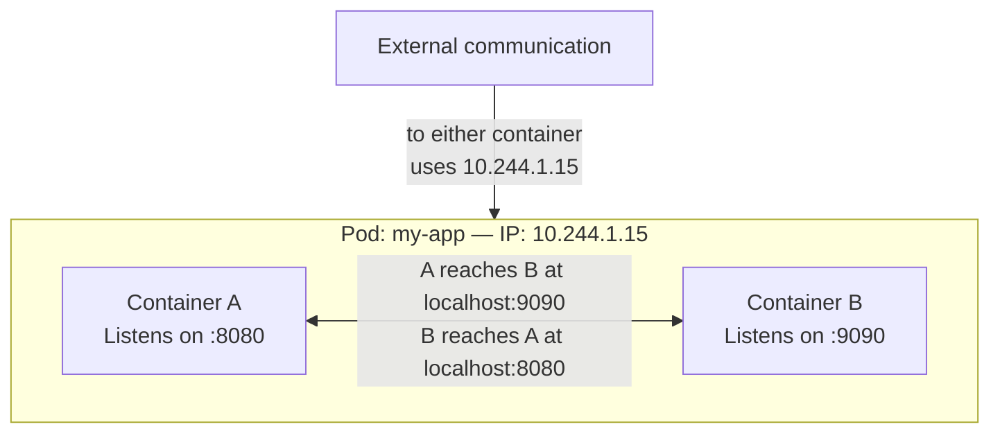

**2\. Shared Volumes**

```yaml
apiVersion: v1
kind: Pod
metadata:
  name: shared-volume-pod
spec:
  containers:
  - name: writer
    image: busybox
    command: ['sh', '-c', 'while true; do date >> /shared/log.txt; sleep 5; done']
    volumeMounts:
    - name: shared-data
      mountPath: /shared
  
  - name: reader
    image: busybox
    command: ['sh', '-c', 'tail -f /shared/log.txt']
    volumeMounts:
    - name: shared-data
      mountPath: /shared
  
  volumes:
  - name: shared-data
    emptyDir: {}
```

In this example:

* `writer` appends timestamps to `/shared/log.txt`
    
* `reader` continuously reads from the same file
    
* Both see the same filesystem at `/shared`
    

**3\. Same Node**

The scheduler places the entire Pod on one node. You're guaranteed both containers run on the same machine.

### Lifecycle Behavior

**Startup Order:**

1. All init containers run first (sequentially)
    
2. All main containers start simultaneously
    
3. There's no guaranteed order among main containers
    

**If One Container Crashes:**

* The crashed container is restarted (based on restartPolicy)
    
* Other containers keep running
    
* The Pod status reflects the issue
    
* If crashes continue, you see CrashLoopBackOff
    

**Example: Handling Container Dependencies**

If container B depends on container A being ready, use readiness probes:

```yaml
containers:
- name: database
  image: postgres
  readinessProbe:
    tcpSocket:
      port: 5432
    initialDelaySeconds: 5
    periodSeconds: 5

- name: app
  image: myapp
  # App should handle DB not being ready initially
  # or use an init container to wait
```

### Practical Multi-Container Example

**Log shipping pattern:**

```yaml
apiVersion: v1
kind: Pod
metadata:
  name: app-with-logging
spec:
  containers:
  # Main application
  - name: app
    image: myapp:latest
    volumeMounts:
    - name: logs
      mountPath: /var/log/app
  
  # Sidecar that ships logs
  - name: log-shipper
    image: fluentd:latest
    volumeMounts:
    - name: logs
      mountPath: /var/log/app
      readOnly: true
    - name: fluentd-config
      mountPath: /fluentd/etc
  
  volumes:
  - name: logs
    emptyDir: {}
  - name: fluentd-config
    configMap:
      name: fluentd-config
```

---

## 6\. Init Containers

### What Are Init Containers?

Init containers are specialized containers that run **before** your main application containers start. They run to completion, one at a time, in order.

**Key Characteristics:**

* Run sequentially, not in parallel
    
* Each must complete successfully before the next starts
    
* If any fails, the Pod restarts (based on restartPolicy)
    
* Only after ALL init containers succeed do main containers start
    
* Can have different images than main containers
    
* Don't support readiness probes (they're not long-running)
    

### Init Container Lifecycle

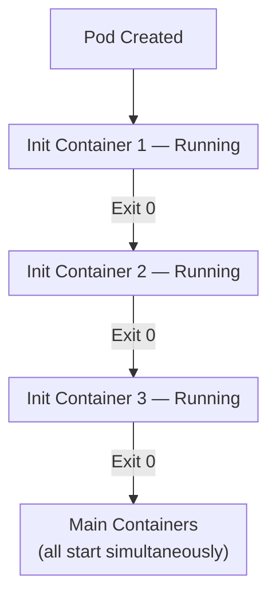

### Common Use Cases

**1\. Wait for a Dependency**

```yaml
initContainers:
- name: wait-for-database
  image: busybox
  command: ['sh', '-c', 
    'until nc -z database-service 5432; do 
       echo "Waiting for database..."; 
       sleep 2; 
     done; 
     echo "Database is ready"']
```

This ensures your app doesn't start until the database is reachable.

**2\. Clone Code or Configuration**

```yaml
initContainers:
- name: clone-repo
  image: alpine/git
  command:
  - git
  - clone
  - --depth=1
  - https://github.com/company/config.git
  - /config
  volumeMounts:
  - name: config
    mountPath: /config
containers:
- name: app
  image: myapp
  volumeMounts:
  - name: config
    mountPath: /app/config
volumes:
- name: config
  emptyDir: {}
```

**3\. Setup File Permissions**

```yaml
initContainers:
- name: fix-permissions
  image: busybox
  command: ['sh', '-c', 'chown -R 1000:1000 /data']
  volumeMounts:
  - name: data
    mountPath: /data
  securityContext:
    runAsUser: 0  # Run as root to change ownership
```

**4\. Generate Configuration**

```yaml
initContainers:
- name: generate-config
  image: busybox
  command: ['sh', '-c', 'echo "server_id=$(hostname)" > /config/server.conf']
  volumeMounts:
  - name: config
    mountPath: /config
```

**5\. Database Migrations**

```yaml
initContainers:
- name: db-migrate
  image: myapp:latest
  command: ['./migrate.sh']
  env:
  - name: DATABASE_URL
    valueFrom:
      secretKeyRef:
        name: db-credentials
        key: url
```

### Complete Init Container Example

```yaml
apiVersion: v1
kind: Pod
metadata:
  name: myapp-pod
spec:
  initContainers:
  # First: wait for database
  - name: wait-db
    image: busybox:1.35
    command: ['sh', '-c', 'until nc -z db-service 3306; do sleep 2; done']
  
  # Second: wait for cache
  - name: wait-cache
    image: busybox:1.35
    command: ['sh', '-c', 'until nc -z redis-service 6379; do sleep 2; done']
  
  # Third: download configuration
  - name: download-config
    image: curlimages/curl:latest
    command: ['sh', '-c', 'curl -o /config/app.json http://config-service/config']
    volumeMounts:
    - name: config
      mountPath: /config
  
  containers:
  - name: app
    image: myapp:v2
    ports:
    - containerPort: 8080
    volumeMounts:
    - name: config
      mountPath: /app/config
    env:
    - name: CONFIG_PATH
      value: "/app/config/app.json"
  
  volumes:
  - name: config
    emptyDir: {}
```

### Debugging Init Containers

```bash
# See init container status
kubectl get pod myapp-pod

# Output might show:
# NAME        READY   STATUS     RESTARTS   AGE
# myapp-pod   0/1     Init:1/3   0          30s

# This means: 1 of 3 init containers completed

# Get logs from specific init container
kubectl logs myapp-pod -c wait-db

# If init container is currently running:
kubectl logs myapp-pod -c wait-cache

# Describe pod to see init container details
kubectl describe pod myapp-pod
```

**Init Status Meanings:**

| Status | Meaning |
| --- | --- |
| `Init:0/3` | 0 of 3 init containers completed |
| `Init:1/3` | 1 of 3 completed, second running |
| `Init:Error` | Current init container failed |
| `Init:CrashLoopBackOff` | Init container keeps crashing |
| `PodInitializing` | All init containers done, main starting |

---

## 7\. Static Pods

### What Are Static Pods?

Static Pods are managed directly by the kubelet on a specific node, without any involvement from the Kubernetes API server, scheduler, or controller manager.

**The key difference:**

* Normal Pods: API server → Scheduler → Kubelet
    
* Static Pods: Kubelet watches a directory → Creates Pod directly
    

### How Static Pods Work

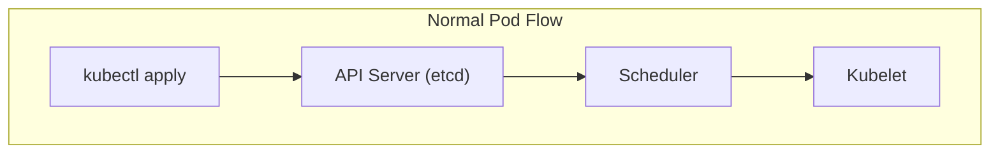

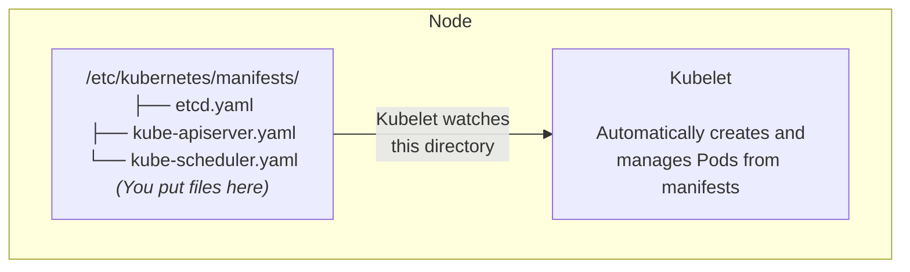

### Why Do Static Pods Exist?

**The Bootstrap Problem:**

When a Kubernetes cluster starts, you face a chicken-and-egg problem:

* The API server is a container that needs to be scheduled
    
* But the scheduler is also a container that needs the API server
    
* And etcd (the database) is also a container
    

Static Pods solve this. The control plane components run as static Pods managed by kubelet directly, without needing the full cluster to be running.

**On a master node, you typically find:**

```plaintext
/etc/kubernetes/manifests/
├── etcd.yaml
├── kube-apiserver.yaml
├── kube-controller-manager.yaml
└── kube-scheduler.yaml
```

### Characteristics of Static Pods

| Aspect | Static Pod Behavior |
| --- | --- |
| Creation | Kubelet creates when manifest appears in watched directory |
| Deletion | Kubelet deletes when manifest is removed |
| Updates | Kubelet updates when manifest file changes |
| API visibility | A mirror Pod appears in API (read-only) |
| Scheduling | No scheduling—runs on the node where manifest exists |
| Pod naming | Node name is appended: `my-pod-node01` |
| Control via kubectl | Cannot delete via API (recreates immediately) |

### Finding the Static Pod Directory

```bash
# Check kubelet configuration
cat /var/lib/kubelet/config.yaml | grep staticPodPath

# Or
ps aux | grep kubelet | grep -- --pod-manifest-path

# Common locations:
# /etc/kubernetes/manifests/
# /etc/kubelet.d/
```

### Creating a Static Pod

```bash
# 1. Create a manifest file
cat <<EOF > /etc/kubernetes/manifests/static-nginx.yaml
apiVersion: v1
kind: Pod
metadata:
  name: static-nginx
spec:
  containers:
  - name: nginx
    image: nginx
    ports:
    - containerPort: 80
EOF

# 2. Kubelet automatically creates it
# Wait a few seconds...

# 3. Verify
kubectl get pods
# Shows: static-nginx-<node-name>

# 4. Try to delete it
kubectl delete pod static-nginx-<node-name>
# Pod immediately recreates!

# 5. Actually delete it by removing the file
rm /etc/kubernetes/manifests/static-nginx.yaml
# Now it's gone
```

### Mirror Pods

When kubelet creates a static Pod, it also creates a "mirror Pod" in the API server. This is read-only and lets you see the static Pod via `kubectl get pods`.

**Mirror Pod characteristics:**

* Has annotation: [`kubernetes.io/config.mirror`](http://kubernetes.io/config.mirror)
    
* Cannot be modified via API
    
* Deleting it via kubectl does nothing (kubelet recreates)
    
* Reflects the real Pod's status
    

```bash
# Identify a mirror pod
kubectl get pod static-nginx-node01 -o yaml | grep -A2 annotations
# annotations:
#   kubernetes.io/config.mirror: "..."
```

### CKAD Relevance

For CKAD, you need to know:

* What static Pods are
    
* How to identify them
    
* Where manifests are stored
    
* That you can't manage them via kubectl
    

You probably won't create static Pods in the exam, but you might be asked to identify them or understand why a Pod keeps recreating after deletion.

---

## 8\. Pod Design Patterns

These patterns describe standard ways to structure multi-container Pods. They come from distributed systems design and solve common problems.

### Pattern 1: Sidecar

**Purpose:** Extend or enhance the main container's functionality without modifying it.

**The Sidecar Analogy:**

Think of a motorcycle with a sidecar. The motorcycle (main container) does the primary work—driving. The sidecar (sidecar container) adds capability—carrying a passenger or cargo. They move together, share the journey, but have different jobs.

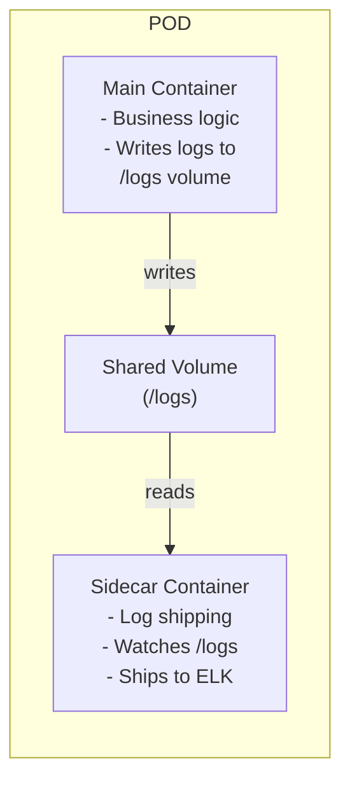

**Common Sidecar Use Cases:**

| Use Case | Main Container | Sidecar |
| --- | --- | --- |
| Logging | App writes logs | Fluentd ships logs |
| Monitoring | App runs | Prometheus exporter |
| Security | App serves traffic | mTLS proxy (Istio) |
| Sync | App uses config | Git-sync updates config |
| Compression | App serves files | Compressor processes uploads |

**Complete Sidecar Example: Log Collection**

```yaml
apiVersion: v1
kind: Pod
metadata:
  name: app-with-log-sidecar
spec:
  containers:
  # Main application
  - name: app
    image: myapp:latest
    command: ['sh', '-c', 'while true; do echo "$(date) - App running" >> /var/log/app/app.log; sleep 5; done']
    volumeMounts:
    - name: log-volume
      mountPath: /var/log/app
  
  # Sidecar: ships logs to external system
  - name: log-shipper
    image: busybox
    command: ['sh', '-c', 'tail -f /var/log/app/app.log']  # Simplified; real would send to logging system
    volumeMounts:
    - name: log-volume
      mountPath: /var/log/app
      readOnly: true
  
  volumes:
  - name: log-volume
    emptyDir: {}
```

**Real-World Sidecar: Service Mesh (Istio)**

In Istio, every Pod gets an Envoy proxy sidecar automatically:

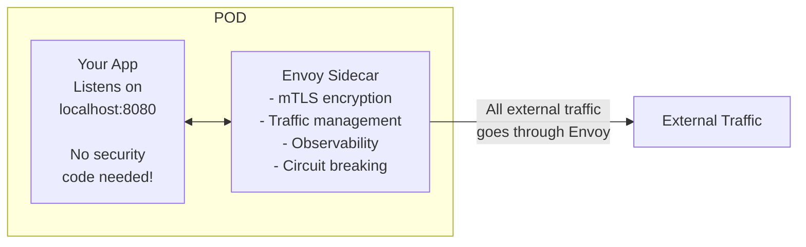

### Pattern 2: Ambassador

**Purpose:** Proxy outbound connections from the main container, simplifying how the app connects to external services.

**The Ambassador Analogy:**

An ambassador represents you in a foreign country. They handle the complexity of diplomacy, translation, and protocol. Your main container just talks to the ambassador ([localhost](http://localhost)), and the ambassador handles the complex external communication.

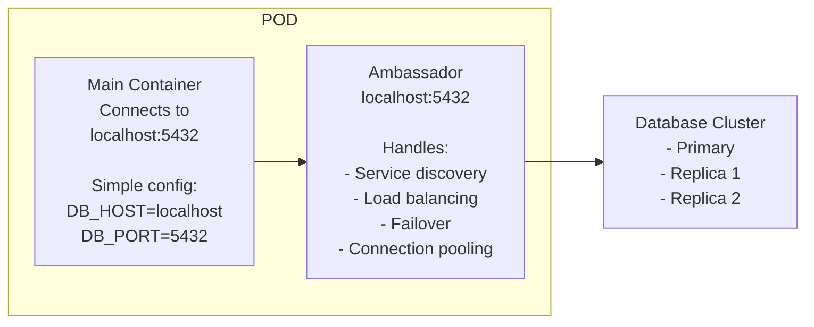

**Why Use Ambassador Pattern:**

Without ambassador:

```python
# App needs complex logic
db = connect_with_retry(
    hosts=['db-1.prod', 'db-2.prod', 'db-3.prod'],
    load_balance=True,
    ssl=True,
    ...
)
```

With ambassador:

```python
# App has simple logic
db = connect('localhost:5432')  # Ambassador handles everything
```

**Ambassador Example: Database Proxy**

```yaml
apiVersion: v1
kind: Pod
metadata:
  name: app-with-ambassador
spec:
  containers:
  # Main app - connects to localhost
  - name: app
    image: myapp:latest
    env:
    - name: DATABASE_HOST
      value: "localhost"
    - name: DATABASE_PORT
      value: "5432"
  
  # Ambassador - proxies to real database
  - name: db-ambassador
    image: haproxy:latest
    ports:
    - containerPort: 5432
    volumeMounts:
    - name: haproxy-config
      mountPath: /usr/local/etc/haproxy
  
  volumes:
  - name: haproxy-config
    configMap:
      name: db-proxy-config
```

**Common Ambassador Use Cases:**

| Scenario | Ambassador Does |
| --- | --- |
| Database cluster | Routes to correct shard, handles failover |
| Redis cluster | Manages cluster topology, routes by key |
| External APIs | Handles retries, rate limiting, auth |
| Legacy systems | Protocol translation |

### Pattern 3: Adapter

**Purpose:** Transform the main container's output into a format that external systems expect.

**The Adapter Analogy:**

Think of a power adapter. Your laptop (main container) outputs one type of power/data. The adapter transforms it to what the wall socket (external system) expects. The main container doesn't need to know about the external system's requirements.

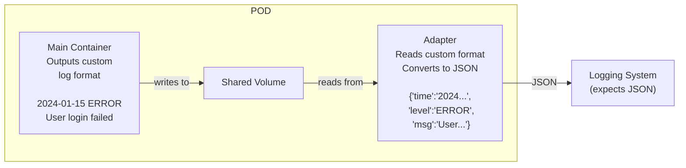

**Common Adapter Use Cases:**

| Input (Main Container) | Output (Adapter) | Consumer |
| --- | --- | --- |
| Custom log format | JSON logs | ELK Stack |
| Application metrics | Prometheus format | Prometheus |
| Custom health check | HTTP endpoint | Kubernetes probes |
| XML data | JSON data | Modern APIs |

**Adapter Example: Prometheus Exporter**

```yaml
apiVersion: v1
kind: Pod
metadata:
  name: app-with-metrics-adapter
  annotations:
    prometheus.io/scrape: "true"
    prometheus.io/port: "9090"
spec:
  containers:
  # Main app - writes metrics in custom format
  - name: app
    image: legacy-app:latest
    volumeMounts:
    - name: metrics
      mountPath: /var/metrics
  
  # Adapter - converts to Prometheus format
  - name: metrics-adapter
    image: prom/statsd-exporter:latest
    ports:
    - containerPort: 9090
      name: metrics
    volumeMounts:
    - name: metrics
      mountPath: /var/metrics
      readOnly: true
  
  volumes:
  - name: metrics
    emptyDir: {}
```

### Comparing the Patterns

| Pattern | Direction | Purpose | Example |
| --- | --- | --- | --- |
| **Sidecar** | Same direction as main | Enhance/extend main container | Log shipping, config reload |
| **Ambassador** | Outbound | Simplify external connections | DB proxy, API gateway |
| **Adapter** | Outbound | Transform output format | Metrics conversion |

**Visual Comparison:**

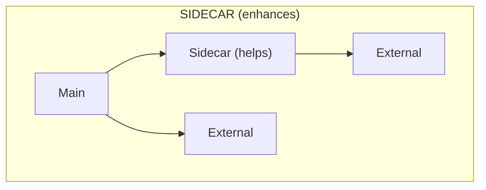

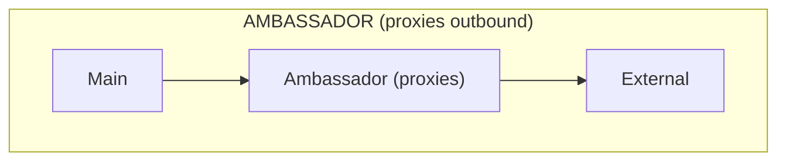

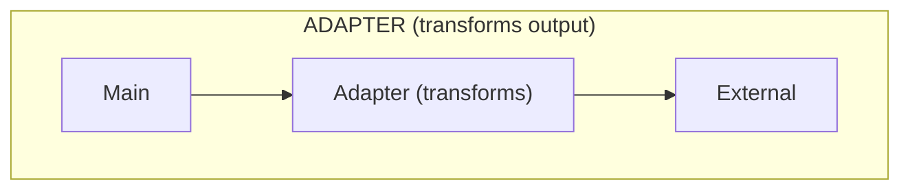

---

## Summary

| Topic | Key Takeaways |
| --- | --- |
| **Pod basics** | Smallest deployable unit; wraps containers; provides shared network/storage |
| **Lifecycle** | Pending → Running → Succeeded/Failed; containers have Waiting/Running/Terminated states |
| **Restart policies** | Always (services), OnFailure (jobs with retry), Never (one-shot jobs) |
| **Imperative** | `kubectl run` — fast, no audit trail, good for quick tasks |
| **Declarative** | YAML + `kubectl apply` — reproducible, version-controlled, production standard |
| **YAML structure** | apiVersion, kind, metadata, spec — every resource follows this |
| **Multi-container** | Shared network ([localhost](http://localhost)), shared volumes, same lifecycle |
| **Init containers** | Run before main containers, sequential, must succeed |
| **Static Pods** | Managed by kubelet directly, used for control plane, mirror pods in API |
| **Sidecar** | Helper that enhances main container (logs, mesh proxy) |
| **Ambassador** | Proxy for outbound connections (DB proxy) |
| **Adapter** | Transforms output format (metrics exporter) |