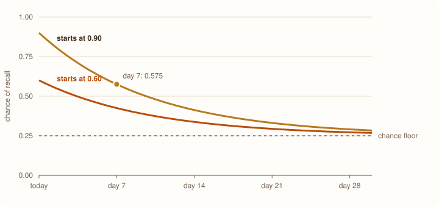

# Building Marigold

A study app that turns your PDFs into flashcards, quizzes you on them, and tries to work out what you're about to forget. Here's how the whole thing fits together, including the parts that broke along the way.

**Stack:** FastAPI and SQLAlchemy · React and Vite · Postgres and Redis · Gemini · PyTorch · Railway

> **The short version, as a flashcard**
>
> **Q:** What does Marigold do, in one breath?
>
> **A:** You upload a PDF, Gemini writes about 15 flashcards from it, and you study and quiz yourself. Every answer you give is logged, and a small model uses that history to rank your topics by how likely you are to have forgotten them.

## Why I built it

Here's the thing about studying. Rereading your notes feels productive. You recognize everything, it all seems familiar, and you walk away feeling ready. Then the exam asks you to actually recall something and it's gone.

The two techniques that reliably work are pretty well known. **Active recall** means testing yourself instead of rereading. **Spaced repetition** means reviewing things right before you'd forget them, not on a fixed schedule. Tools like Anki do this well, but they make you write every card by hand, and writing cards is exactly the part people skip.

So Marigold does both halves for you. It writes the cards from your own notes, and it keeps track of what's slipping so your next session starts with whatever needs it most.

## The stack

Nothing exotic here. I picked boring, well-supported tools everywhere except the one place that's actually interesting, which is the scheduling model.

| Layer | What I used | Why |
| --- | --- | --- |
| Frontend | React 18, Vite, React Router 7, Tailwind with DaisyUI | Fast builds, and DaisyUI gives accessible components I could re-theme |
| Web server | nginx | Serves the bundle and proxies API calls so the browser sees one site |
| API | FastAPI, SQLAlchemy 2, Pydantic v2 | Typed request handling and dependency injection for auth |
| Database | PostgreSQL, with Alembic for migrations | Real foreign keys, and schema changes that get reviewed |
| Cache | Redis | Login rate-limit counters shared across processes |
| AI | Google Gemini, PyMuPDF | PyMuPDF pulls the text out, Gemini writes the cards |
| ML | PyTorch, plus a pure-Python statistical prior | A transformer for long histories, something simple for new users |
| Hosting | Railway, two Docker images | Push to deploy, managed Postgres and Redis next door |

## Architecture

In production there are two app services, plus Postgres and Redis. The part that took me longest to get right is how the browser talks to them, so let's walk a single request from start to finish.

1. **Your browser** (the React app) calls `GET https://marigold-web…/api/review/next`. The app only ever calls its own site. It has no idea where the API actually lives.
2. **marigold-web** (nginx) forwards anything under `/api` to the API service. Everything else is the static React bundle, with a fallback to `index.html` so deep links like `/deck/12` work on refresh.
3. **marigold-api** (FastAPI on uvicorn) checks the token, runs the request, and talks to everything else: Postgres for all the data, Redis for rate limits, and Gemini for writing cards.

One request, three hops. The browser sees a single origin the whole way.

### Why the proxy matters so much

My first version of the two-service setup had the frontend call the API's own domain directly. It looked fine in Chrome. The problem is login. The refresh token lives in an `HttpOnly` cookie, and when the frontend and the API are on different domains that cookie counts as *cross-site*. Safari drops cross-site cookies, which meant staying signed in and Google sign-in would both quietly fail there.

Putting nginx in front and proxying `/api` fixes it at the root. From the browser's point of view there's only one site, so the cookie is first-party, there's no CORS to configure, and it works everywhere. Here's the heart of the nginx config:

```nginx
location /api/ {
    set $backend ${BACKEND_URL};        # filled in when the container starts
    proxy_pass $backend;                # a variable, so the host is re-resolved
    proxy_ssl_server_name on;
    proxy_set_header Host $proxy_host;
    proxy_read_timeout 300s;            # regenerating a deck can be slow
}
```

Two small details in there saved me real bugs. nginx's default upload limit is 1 MB, which rejects most real PDFs, so I raised it to 25 MB. And if `BACKEND_URL` is missing or has a path on the end, a tiny startup script stops the container with a sentence explaining what's wrong, instead of nginx failing with a confusing syntax error.

## From PDF to flashcards

This is the main thing a user does, so I wanted it to feel instant even though the actual work takes a while.

**The upload returns straight away.** You drop in a PDF and the API immediately answers with `status: processing`. The real work happens in a background task, and the page just polls every so often until the document flips to `ready` or `failed`. That way upload time doesn't depend on how long your document is.

**Text extraction happens in memory.** PyMuPDF reads the file straight from the upload bytes, and only the extracted text gets saved to Postgres. Nothing is ever written to disk, which is also why the service doesn't need a storage volume.

**Gemini writes the cards.** The extracted text goes to Gemini with a request for 15 cards. Each card comes back with a question, an answer, a topic label, and three wrong-but-plausible answers. Those wrong answers are what turn a flashcard deck into a multiple-choice quiz later.

> **A bug that only production could find.** One of my first real uploads was a 111-page PDF, and it failed with "Failed to fetch". The actual error was buried in the server logs: Postgres refuses text containing NUL bytes (`\x00`), and some PDFs with broken embedded fonts are full of them. My tests all passed because they ran on SQLite, which happily stores NUL bytes. The fix was one line to strip them, but it's the reason my tests now run against real Postgres too.

There's also a **regenerate** button that throws away a deck's cards and asks Gemini for a fresh set. Unlike upload, that one runs synchronously, which is why nginx gets that generous 300-second timeout.

## The data model

The schema is small. Here's what each table is for:

- **users** and **auth_providers**: accounts, plus linked Google or GitHub identities.
- **documents**: one row per upload, with its status and the extracted text.
- **flashcards**: the cards, each pointing at its document and at a concept.
- **concepts**: the topics being tracked for each user, like "Photosynthesis".
- **quiz_sessions** and **quiz_answers**: quiz attempts and what you picked for each question.
- **interactions**: every graded attempt you've ever made. This is the important one.

The interactions table is basically the training data for the whole ML side, so I was careful with it. Its link to a flashcard is set to `ON DELETE SET NULL`. That means if you delete a card or regenerate a deck, your history for that topic survives. The scheduler shouldn't forget that you've studied something just because the card got rewritten.

Concepts come from the topic label Gemini assigns to each card. Gemini isn't consistent about capitalization or punctuation, so labels get normalized first. "Photosynthesis ", "photosynthesis" and "Photosynthesis!" all end up as the same concept.

## Studying and quizzes

There are two ways to use a deck.

**Study mode** is classic flashcards. You see the question, press space or tap to flip it, and mark whether you knew it with "Got it" or "Still learning".

**Quiz mode** is timed multiple choice, with 30 seconds per question. The options are the real answer shuffled together with Gemini's three distractors. When you finish, you get a score, the questions you slipped on, and a full review of your answers.

Both modes feed the same place. Every graded attempt writes an interaction row with the concept, whether you got it right, how long you took, and when it happened. A skipped quiz question is logged too, but marked as giving no evidence either way, since skipping doesn't tell you whether someone knew the answer.

## Accounts and security

Auth is the least glamorous part of any app and the easiest to get subtly wrong, so it got more attention than you might expect.

- **Two tokens.** A short-lived JWT access token lasts 15 minutes. A refresh token lasts 7 days and lives in an `HttpOnly` cookie that JavaScript can't read. The refresh token rotates every time it's used, so a stolen one stops working quickly.
- **Google and GitHub sign-in** go through Authlib, with state and PKCE checks. If a provider account has the same email as an existing one, they're linked properly rather than creating a duplicate. The sign-in buttons only appear for providers that actually have credentials configured, because a button that errors when you click it is worse than no button.
- **Rate limiting** lives in Redis: 5 failed logins per account and 20 per IP address in a 15-minute window.
- **Email verification and password reset** use signed, single-use tokens. Reset links expire after 30 minutes.
- **Route guards** put every page in one of three groups: public, signed-out only, or signed-in only. If you open a protected link while signed out, you get sent to log in and then land back where you were headed. The redirect only accepts paths inside the app, so it can't be abused to bounce people to another site.

> **One reset bug I'm glad I caught.** The reset flow used to mark the link as used *before* checking the new password against the password rules. So if you typed a password that was too weak, you got an error, and your reset link was already burned. Now the password is validated first, and the token only gets spent on success.

## The frontend

The UI is React with Tailwind and DaisyUI. I started from DaisyUI's winter theme and then swapped every color for marigold shades: a burnt orange for buttons and links, a warm marigold yellow, cream and sand surfaces, and a dark espresso brown for text. I checked every text and background pairing against the WCAG AA contrast guidelines, which is why the main orange is a deep burnt orange instead of something brighter. A brighter orange just isn't readable behind white text.

A few details I like:

- The landing page hero has a real flashcard that flips on its own, cycling through a few example questions. It pauses when you hover over it so you can actually read it, and if your system asks for reduced motion it just shows both sides instead of animating.
- The 404 page renders in place instead of redirecting home, so the broken URL stays in the address bar where you can see it and report it.
- The review queue has "Today", "In a week" and "In a month" tabs, which ask the model to project forward in time. That's handy for planning before an exam.

## The ML part

This is the bit I find most interesting. The goal is simple to say: given everything you've answered so far, which topics should you review right now?

### Two models, picked by how much history you have

A brand-new user and someone with months of history need different approaches, so Marigold has two. A single function decides which one to trust, and the cutoff is 20 interactions.

**Below 20, a statistical prior.** With only a handful of answers there's no way to learn anything personal about you. What you *can* say is how hard a topic is for people in general, nudged by the little you've seen from this person. That's a Beta-Bernoulli estimate: a topic's success rate pulled toward the overall average, so a topic with just two answers doesn't swing to 0% or 100%.

I deliberately didn't use Bayesian Knowledge Tracing here, even though it's the classic choice. BKT fits four parameters per topic with an algorithm that's notorious for settling on nonsense values, where getting more answers right actually makes the prediction worse. The cold-start path is exactly what a new user sees first, so I'd rather it be simple and correct than clever and occasionally wrong.

**From 20 up, SAKT.** SAKT is a small transformer built for knowledge tracing. It looks at your sequence of past answers and predicts whether you'll get the next one right. Mine is a single self-attention layer with 8 heads, 128 dimensions, and a causal mask so it can only look at the past, reading up to your last 200 answers.

### Forgetting is added on top

Here's a subtle point. Knowledge tracing predicts whether you'll get something right, but it doesn't really model *time*. If you nailed a topic three weeks ago, a raw prediction still thinks you know it. So Marigold applies an explicit forgetting curve on top of whichever model made the prediction:

```text
p(t) = floor + (p0 − floor) × 2^(−t / half_life)

half_life = 7 days
floor     = 0.25
```

Your chance of recall decays toward a floor instead of toward zero. The floor is 0.25 because a four-option quiz gives you a 25% chance even if you've forgotten everything. Here's what that looks like:



*Recall predicted by Marigold's decay function over 30 days. The dot marks one half-life: a topic you knew at 0.90 is back to 0.575 after 7 days.*

This curve is also what powers the "In a week" and "In a month" tabs. The model just evaluates the same formula at a future date.

### How the model did

I trained SAKT on ASSISTments 2009, a public dataset of students answering math problems, holding out each student's most recent answers for evaluation. I retrained it from scratch while writing this to make sure the numbers hold up:

| Measure | Result |
| --- | ---: |
| Held-out AUC | 0.756 |
| Interactions | 277,720 |
| Students | 3,022 |
| Skills | 149 |
| Correct answers in the evaluation set | 61.6% |

That last row keeps the first one honest. A model that just guesses "correct" every time is right 61.6% of the time, and an AUC of 0.5 means random guessing. So 0.756 is a real signal but not a dramatic one, and it lands right where published SAKT results on this dataset sit.

### The honest part: what's actually running

If you use Marigold today, **the transformer isn't what ranks your topics**. The trained model knows ASSISTments' 149 math skills, not your topics like "Photosynthesis", and there's no mapping between the two yet. So every topic goes through the prior plus the forgetting curve. The API even says so: every ranked topic comes back tagged `source: "prior"`.

I leaned into that when packaging it. PyTorch is only imported if a model file actually exists, and I don't ship one yet. That keeps the API image at 591 MB. Adding even the CPU-only PyTorch build pushes it to 1.99 GB, and all that extra size would produce exactly the same rankings.

One more thing I found while writing this up: the prior isn't fitted from real data yet either. It's falling back to a flat 50% baseline for every topic, so right now the forgetting curve and your own answers are doing most of the work. Fitting it properly is next on the list.

## Bugs worth telling

Some of the most useful stuff I learned came from things breaking. These three are my favorites.

### "Failed to fetch" that was really a database error

Regenerating a deck started failing with "Failed to fetch", which sounds like a network problem. It wasn't. The regenerate code deleted a deck's old cards with a single bulk delete query, and bulk deletes skip the cascade rules that normally clean up related rows. So any card that had ever appeared in a quiz still had quiz answers pointing at it, and Postgres refused the delete. It only broke once you'd taken a quiz on that deck, which is why my tests never caught it.

The second half is why it looked like a network error. The unhandled error was caught by a layer of FastAPI that sits *outside* the CORS handling, so the error response went out without CORS headers. In development the frontend and API were on different ports, and the browser refuses to show a response that's missing those headers, so all you got was "Failed to fetch". I fixed the delete, and added a handler so database errors now come back as proper, readable errors.

### The connection pool cliff

I wanted real throughput numbers, so I wrote a small load tester and pointed it at the API. At 16 simultaneous users everything looked great. At 64, it fell off a cliff:

| Endpoint at 64 concurrent users | Before | After |
| --- | ---: | ---: |
| Current user | 0.9 req/s | 604 req/s |
| Review queue | 0.6 req/s | 231 req/s |
| Stats | 0.5 req/s | 217 req/s |
| Failed requests per run | 63 of 64 | 0 |

*Measured locally in Docker with one API worker, calling the API directly.*

The funny part is that I couldn't see the cause at first, because of a bug in my own error handler. It was logging "NoneType: None" where the actual error should have been. Once I fixed that, the real message showed up straight away: the database connection pool was full. I'd never configured it, so it was running on SQLAlchemy's defaults of just 15 connections. Past that, every extra request waited 30 seconds and then failed. I sized the pool to 10 connections plus 20 overflow, based on how many requests the server can actually run at once, and the errors disappeared.

### A setting that stopped the app from starting

Settings are checked in the order they're defined. One check made sure a cookie setting was only used with secure cookies, but it ran *before* the code that turns secure cookies on for Railway. So a perfectly valid production config refused to boot. The fix was just moving that check to run last, and there's now a test that recreates the exact situation so it can't come back.

## Deploying on Railway

Everything deploys from two Dockerfiles, one for each service, both built from the root of the repository.

**The API image** is Python only. When the container starts, it runs database migrations first and only then starts the server:

```sh
set -e
alembic upgrade head
exec uvicorn backend.main:app --host 0.0.0.0 --port "${PORT:-8000}"
```

The order there is doing real work. `set -e` means a failed migration stops the container, so the health check never passes, and Railway keeps the previous version running instead of switching to a build whose code and database disagree. The `exec` lets the server receive shutdown signals directly, so redeploys drain cleanly. The container also runs as a non-root user, and I keep the API at one replica, because two copies starting at once would race to run the same migration.

**The frontend image** builds the React app, then copies the result into a small nginx image. It doesn't need to know the API's address at build time, because nginx reads it when the container starts. Pointing the frontend at a different API is just a variable change and a restart.

Configuration boils down to two cross-references, which Railway fills in and keeps up to date:

```sh
# on marigold-api
PUBLIC_URL=https://${{marigold-web.RAILWAY_PUBLIC_DOMAIN}}

# on marigold-web
BACKEND_URL=https://${{marigold-api.RAILWAY_PUBLIC_DOMAIN}}
```

That one `PUBLIC_URL` fills in everything that depends on the public address: the links in emails, where Google sign-in sends you back to, and turning on secure cookies. Before, it took four separate settings, and getting any one of them wrong broke login in a way that didn't show up until someone tried to sign in.

> **The deploy gotcha that cost me the most time:** Railway will happily ignore your Dockerfile. If the builder isn't explicitly set to Dockerfile, it falls back to auto-detection, can't find a start command, and fails the build before your Dockerfile is ever read. A close second: typing `${{Postgres.DATABASE_URL}}` by hand instead of using Railway's reference picker. If the name doesn't match exactly, the literal text gets passed through, and SQLAlchemy fails with "Could not parse SQLAlchemy URL".

## By the numbers

Everything in this table comes from something I actually ran, not an estimate.

| What | Number | Where it comes from |
| --- | ---: | --- |
| Backend tests | 252 passing | Full suite, run against Postgres |
| ML tests | 112 passing | ML pipeline suite |
| API image size | 591 MB | 1.99 GB if PyTorch were bundled |
| Signed-in requests per second | 629 | 16 concurrent users, one worker, local Docker |
| Same, at 64 users after the pool fix | 604 | Up from 0.9 before the fix |
| SAKT held-out AUC | 0.756 | Retrained on ASSISTments 2009 |
| Cards per upload | 15 | What the ingest step asks Gemini for |
| Largest upload | 25 MB | nginx limit; a 2.9 MB PDF tested through the proxy |

## What isn't done yet

I'd rather be upfront about this than pretend the app is finished. Some features are switched off because the thing they depend on doesn't exist yet, and the code for them is commented out rather than deleted.

- **Email delivery.** Nothing actually sends email yet, so email verification is turned off and the password reset screens are hidden. The code is all still there and tested, waiting for an email provider.
- **Billing.** There's no payment system, so the Pro and Team plans are hidden and Marigold is free.
- **Fitting the prior.** Replacing that flat 50% baseline with real difficulty numbers learned from everyone's answers. This is the biggest improvement available right now, and it doesn't need PyTorch.
- **Training SAKT on Marigold's own data.** That needs a lot more real answer history than the app has, which is exactly why the prior handles everyone for now.
- **Smarter topics.** I've written and tested clustering code that would group cards by meaning instead of by Gemini's topic label. It isn't wired into the app yet.
- **A slow endpoint.** Loading a deck's cards manages about 55 requests per second, far slower than everything else, because every card gets decoded and validated on every request. It's the obvious next performance fix.

---

*If there's one thing I'd take from building this, it's to measure before believing. The pool problem was invisible at normal load, the NUL bytes only existed in real PDFs, and the Safari cookie issue never showed up in Chrome. Every one of those looked fine right up until I actually checked.*
