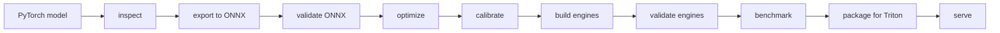
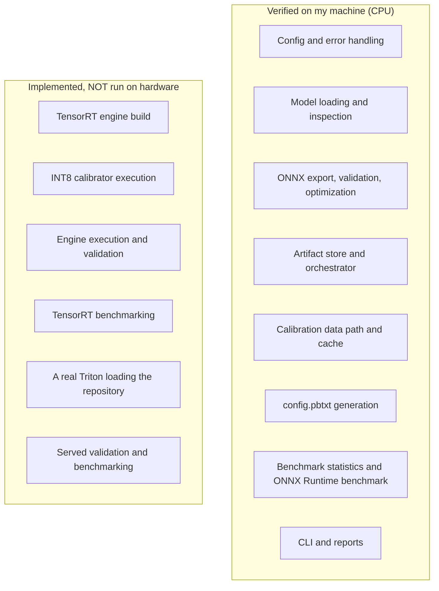
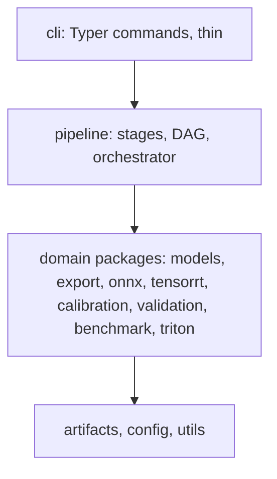
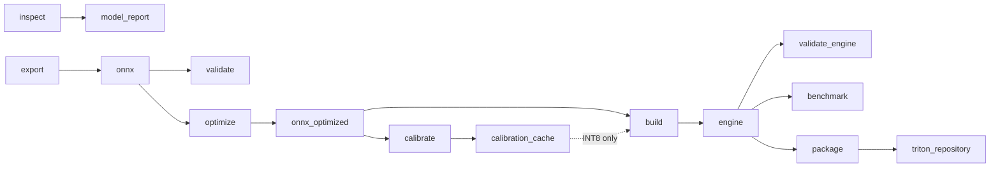
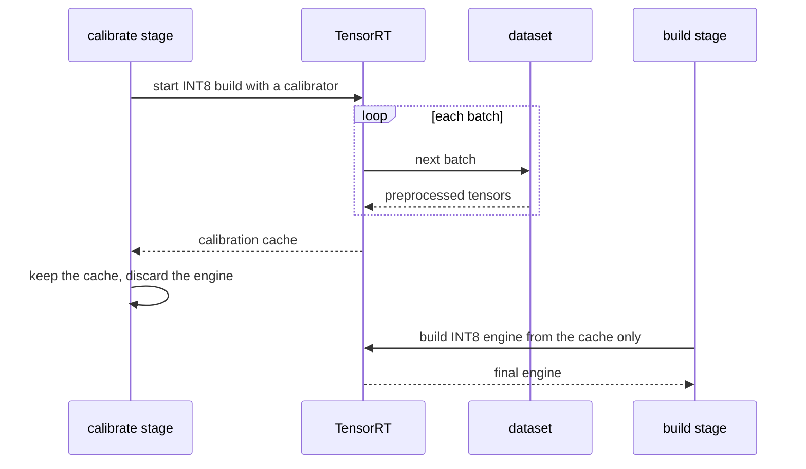
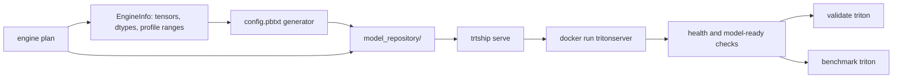
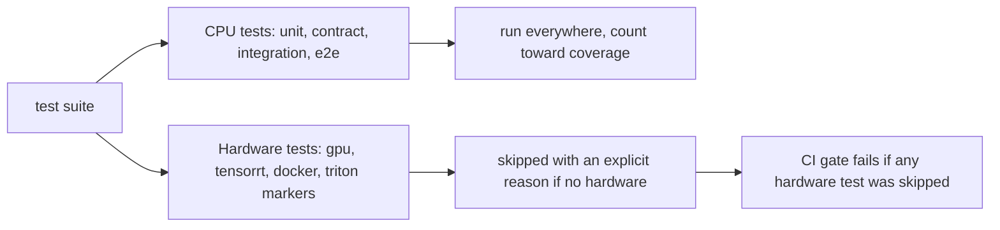

# I built a PyTorch-to-Triton deployment pipeline, and I couldn't run half of it

Every time I've moved a model from "works in my notebook" to "serves traffic," I've done the same
things. Export to ONNX, find out the export quietly baked in a batch size, fix it, build a TensorRT
engine, wonder if FP16 broke anything, try INT8, wonder harder, write a `config.pbtxt` by hand,
get one dimension wrong, and then benchmark the whole thing with a script I'll never see again.

So I built a tool. It's called **trtship**. You give it a PyTorch model and a YAML
file, and it takes the model through export, validation, optimization, TensorRT engines (FP32, FP16
and INT8), calibration, numerical checks, benchmarking, and a Triton model repository. It writes
reports along the way.

This post is about how it works and the decisions I made. It's also about an awkward fact I'll
get to early: the machine I built it on has a broken GPU driver. So a big chunk of the pipeline has
never run on a GPU. I'll be straight about which parts, because I think that's the most useful
thing I can tell you.

## What it does

The whole thing is one pipeline:



Each box is a stage. Every stage can run on its own (`trtship export`, `trtship build`, and so on),
or you can run them all with `trtship run config.yaml`. `calibrate` only matters if you ask for
INT8. `serve` isn't a real stage. It starts a server rather than producing a file, so it's a
separate command.

A config for a tiny CNN looks like this:

```yaml
model:
  name: tinyconv
  kind: module
  factory: custom_model.model:build
  inputs:
    - name: image
      dtype: float32
      shape: [batch, 3, 32, 32]      # a string dimension is dynamic
  output_names: [logits]

export:
  opset: 17

tensorrt:
  precisions: [fp32, fp16]
  workspace_mb: 1024
  profiles:
    - inputs:
        image:
          min: [1, 3, 32, 32]
          opt: [8, 3, 32, 32]
          max: [32, 3, 32, 32]

validation:
  num_samples: 4
```

And the CPU half of the pipeline runs anywhere:

```bash
trtship doctor                                                     # what can this machine run?
trtship config validate configs/examples/custom_model.yaml
trtship run configs/examples/custom_model.yaml --until optimize    # inspect, export, validate, optimize
trtship report                                                     # summarize the latest run
```

## The honest bit: what I could and couldn't verify

My dev machine is a laptop with a GTX 1050 Ti. `nvidia-smi` on it says:

```
Failed to initialize NVML: Driver/library version mismatch
```

The kernel module and the userspace library are on different versions. A reboot would probably fix
it. Even then, it's a Pascal card, and I don't know whether current TensorRT still supports it. I
tried to settle that from NVIDIA's docs, but the support matrix is a JavaScript page with nothing
useful in the static HTML.

There's also no TensorRT install here, no Triton image, and Docker has no NVIDIA runtime. So this
is the situation:



The second box is written against the real TensorRT and Triton APIs. It has a lot of tests,
but those tests use stand-ins: a fake `tensorrt` module and a fake Triton server. I'll explain
what that does and doesn't prove later. For now the rule I set for myself was simple:

> Nothing gets called "working" until it has run on real hardware. And no benchmark number appears
> anywhere unless something actually measured it.

That's why the repo contains no TensorRT or Triton benchmark numbers at all. I don't have any.
The README has a verification table that says "not yet verified on hardware" next to each of those
rows, and I'd rather that be in there than have you find out the hard way.

## How it's put together

The code is split into layers, and imports only go downward:



The CLI parses arguments and prints things. The pipeline layer decides what runs and in what order.
The domain packages do the actual work and don't know about the CLI or the pipeline. That rule sounds
strict, but it's what let me test almost everything without a GPU. Most of the logic doesn't care
whether a GPU is there.

The project is about 12,600 lines of source and about 12,800 lines of tests.

### Stages declare what they need, not where they sit

Every stage says which artifact types it `requires` and which it `produces`. The orchestrator builds
the order from that:



This is why `calibrate` runs before `build` when you use INT8: `build` needs the calibration cache,
so the graph puts it first. Order comes from the data, not from a list position. It also meant that
when I added the GPU stages later, I didn't have to touch the orchestrator at all.

### Artifacts are immutable and content-addressed

Everything a stage produces is an artifact with an ID like `onnx-3fa9c1d20b7e`, which is the type
plus the first 12 characters of its SHA-256. Artifacts record their parents, their producing
stage, their size, and their hash. Once written, they're never modified. `optimize` doesn't touch
your exported ONNX. It writes a new file next to it.

A few things fall out of that:

- **Caching is free.** A stage's cache key is the hash of its input hashes, its config slice, and
  the tool versions. Same key means reuse the artifact.
- **Tampering is caught.** Every time an artifact is used, it's re-hashed. If the hash doesn't
  match, the producing stage reruns and publishes a new version. The damaged file stays around as
  evidence.
- **A crash can't leave half a file.** Stages write into a scratch directory and then *publish*,
  which moves files into place without overwriting.

Each run gets a directory like `runs/2026-09-19_ab12cd/` with the config snapshot, a manifest, an
`environment.json` (Python, torch, TensorRT, GPU, driver, git commit), the artifacts, reports, and
logs. If something looks odd next week, I can see exactly what produced it.

### Errors have exit codes

Every expected failure has its own exit code, so scripts and CI can react to it:

| code | meaning |
|---|---|
| 2 | bad config |
| 3 | something needed isn't available (GPU, TensorRT, Docker, Triton) |
| 4 | model failed to load or inspect |
| 5 | ONNX export failed |
| 6 | numerical validation exceeded tolerance |
| 7 | TensorRT build failed |
| 8 | calibration failed |
| 9 | benchmark couldn't run |
| 10 | Triton problem |
| 11 | artifact conflict or corruption |
| 70 | an unexpected bug, with a traceback |

There's one rule I hold firmly: **GPU work never falls back to CPU.** If a stage needs a GPU and
there isn't one, you get exit code 3 and a clear message. A quiet fallback would give you numbers
that look like GPU numbers and aren't.

The orchestrator also does a preflight. Before it runs anything, it checks that every selected
stage can run on this machine. If you ask a CPU-only box for a full run, it doesn't do four stages
and then fail. It fails up front and tells you the `--until` that would have worked.

## The stages, one at a time

### Inspect and export

`inspect` loads the model and reports parameters, an upper bound on activation memory, and the I/O
signature. I say "upper bound" on purpose. Peak activation memory depends on how the runtime
reuses buffers, so I can't measure it honestly from PyTorch hooks. I sum every leaf module's output
size and label it as an upper bound. Real memory numbers come from the benchmark.

You declare input shapes in the config instead of having me guess them. You can't soundly infer
them from an arbitrary `nn.Module`. trtship verifies your declaration with a real forward pass.
Nothing in the tool assumes image classification. The example configs include a ResNet-50, a
BERT-style model, and a small custom CNN.

Loading a pickled checkpoint or TorchScript file means running code, so I treat it that way. It
uses `torch.load(weights_only=True)` by default. Turning that off takes an explicit
`model.trust_source: true`, and it logs a warning.

`export` writes the ONNX file, and it never overwrites its destination.

### Validate ONNX: the bug that shaped the design

This one is my favourite story from the project. While testing export, I wrote a model with this in
its `forward`:

```python
int(x.shape[0])
```

The ONNX exporter traced it, and it baked in the batch size I used while tracing. The graph *said*
its batch dimension was dynamic. The export passed every check on declared shapes. But when I ran
it in ONNX Runtime with a batch of 2, it returned a batch of 4.

The lesson: export succeeding doesn't prove dynamic shapes work. Only running the graph at several
shapes does. So validation runs the graph in ONNX Runtime on the CPU at the profile's `min`, `opt`
and `max` shapes and compares the results with PyTorch. That model is now a regression fixture. It
passes at `opt` and fails at `min` and `max`, which is exactly what should happen.

A couple of other choices in validation:

- ORT runs with its own graph optimizations off, so it's the exported artifact that gets validated
  and not something ORT rewrote.
- A report is always written, even on failure. The exit code 6 comes *after* the evidence is saved.
- I use the per-sample minimum cosine similarity for pass/fail. A global cosine can hide a single
  badly wrong sample.

### Optimize

I wrote six small ONNX graph passes myself, directly on the protobuf. I looked at `onnxoptimizer`,
`onnx-simplifier` and ONNX Runtime's offline optimizer first. The ORT higher levels emit fused
operators that TensorRT can't parse. The other two add native dependencies I couldn't promise would
work with the very new `onnx` version I'm on.

My passes are conservative and boring. TensorRT does the heavy optimizing, so these mostly tidy up.
On an already clean export they do very little, and I documented that rather than dressing it up.
Every optimized file gets checked against the model signature before it's published.

### Build engines: FP32, FP16, INT8

`build` turns the ONNX into TensorRT plans, one per precision you ask for:

| precision | how it's built | what to check |
|---|---|---|
| `fp32` | no reduced-precision flags | the reference engine |
| `fp16` | TensorRT's `FP16` flag | a warning if the GPU has no fast FP16 |
| `int8` | `INT8` from a calibration cache, with FP16 fallback for layers lacking an INT8 kernel | needs calibration data, and you must check accuracy |

Two small things I'm happy with. First, the `trt` module is a *parameter* to `build_engine`. The same
code path runs against the real TensorRT and against my fake, so there's no test-only branch in
production code. Second, engine cache keys include the TensorRT version, the GPU name and compute
capability, and the driver. A plan built for one setup can't get reused on an incompatible one.

### Calibrate: build to calibrate

INT8 needs representative data to choose activation scales. The trick with TensorRT is that it
computes those scales *during* an INT8 build. So my `calibrate` stage runs a build with a
data-feeding calibrator, keeps the resulting cache, and throws the engine away. Then `build` makes
the real INT8 engine from that cache alone.



It costs one extra build. In exchange, the final engine never depends on calibration-time state,
and the cache is a plain file I can hash and check.

The rules around the cache are strict:

- **Reuse requires proof.** If you point at an existing cache, trtship checks the dataset
  fingerprint, sample count, batch size, method, preprocessing, seed, model hash, ONNX hash and
  TensorRT version. If anything mismatches, you get an error listing every mismatch. It never
  quietly uses a stale cache.
- **Dataset identity is content.** The fingerprint hashes file contents, not paths or modification
  times. Move the dataset and its identity is the same. Edit one image and it changes.
- **Synthetic data is opt-in.** Random calibration data produces bad scales. It's refused unless
  you set `allow_synthetic: true`, and the result is marked `representative: false`.

### Validate engines

Once an engine exists, `validate engine` runs it and compares its outputs with PyTorch, using a
tolerance per precision. I gate on PyTorch, and I report the ONNX comparison as context. That way
each engine has exactly one pass/fail. The default tolerances are starting points, not guarantees.
An INT8 engine passes if it stays inside the tolerance *you* set for your task.

### Benchmark

Each measurement is a `(batch size, concurrency)` pair. For each one, the first call (cold) is
recorded separately, then some warmup iterations get thrown away, then the timed run is recorded.
Every request is split into phases: preprocess, execute, postprocess, and end-to-end. Each phase
reports min, mean, stdev, p50, p90, p95, p99 and max.

The runner owns the loop and the statistics. A small `BenchmarkTarget` interface owns the actual
work (ONNX Runtime, TensorRT direct, Triton). So the percentile math, warmup handling and
concurrency accounting are tested once, with injected clocks and exact expected values.

Some honesty rules again:

- Every measurement is labelled with its backend and device.
- GPU memory is `null` unless it was actually measured.
- A directly executed TensorRT engine runs one request at a time. Combinations with concurrency
  above 1 are listed under `skipped` with the reason, not faked. You measure concurrency through
  Triton.
- The benchmark stage is never cached. It's a measurement of this machine right now.
- The ONNX Runtime CPU baseline is a CPU number. Comparing it with a GPU engine shows the benefit
  of moving to a GPU, not a fair framework comparison.

The ONNX Runtime CPU benchmark is real and runs on my laptop. It's the only benchmark I've been
able to run for real.

### Package and serve with Triton

Writing `config.pbtxt` by hand is where I always trip. So trtship generates it from the engine's own
tensor list and optimization profile. Names, dtypes and batch limits can't drift from the plan
because they come from the plan. `triton.max_batch_size` can only *lower* the engine's limit.
Asking for more is a config error that names both numbers.

Packaging doesn't need a GPU. The engine's I/O description is saved next to the plan when it's
built, so `package` is just turning that into text.



`serve` drives the official Triton image through the Docker command line. I picked the CLI over the
Docker SDK because it's one fewer dependency and it runs the same commands I'd type myself. Every
call is an argument list, never a shell string. The server binds to `127.0.0.1` by default,
because **Triton has no authentication**. Exposing it to a network is a deliberate setting you have
to change, and the security doc says so loudly.

There's also no default Triton image. A TensorRT plan only loads on the TensorRT version that built
it, so you pick the release whose TensorRT matches. A default would be a trap.

Once it's serving, `validate triton` reruns the numerical comparison *through the served model*, and
`benchmark triton` measures it and reads the server's own queue and compute statistics. That lets you
separate the engine's time from the overhead of serving it.

## How I tested the stuff I couldn't run

This is the part I most want to be careful about. There's a fake `tensorrt` module in `tests/fakes`.
It records the calls trtship makes, so tests can assert on workspace bytes, flags, profile shapes,
and error handling. There's also a stub server that speaks Triton's HTTP/gRPC protocol, and the tests
talk to it with the real `tritonclient`.

Here's what those prove: trtship makes the calls I think it makes, and it parses the responses I
think it parses. Here's what they don't prove: that real TensorRT accepts those calls, or that a
real Triton loads the output. A fake can't tell you that.

So I split the tests along that line:



The current state is **1068 passed, 7 skipped**, with 96% coverage. Those 7 skipped tests are the
GPU ones, and they print the real reason: `no usable NVIDIA GPU: Failed to initialize NVML`. A
skipped test is not a passed test. The GPU workflow runs a small script, `require_no_skips.py`,
that reads the JUnit XML and fails if anything was skipped, so a runner without a GPU can't report
green by accident.

There are also contract tests that parse my documentation. Every `trtship ...` command in every
markdown file is checked against the real CLI: does the command exist, does it have those flags, do
the config files it names exist. Every relative link is checked too. I added these after my first
README draft had wrong command syntax in several places. Now the docs can't drift without a test
failing.

## Bugs my tests caught along the way

A few of my favourites, because they're the kind of thing that only shows up when you write the test:

- `NumpyDataset.__len__` crashed on any real array, because I'd written `array or []`, which numpy
  refuses to evaluate.
- My first draft of the build stage never passed the calibrator to `build_engine`. A reformat had
  defeated an edit, and nothing complained until a test asserted it.
- The first draft of the engine executor kept input buffers on the executor object, so binding twice
  would have freed the first set. Bound executions now own their buffers.
- Exposing the engine validator from the package `__init__` created an import cycle. It's now
  imported directly.
- Real runs of the example config exposed two bugs the unit tests had missed: the stage order in the
  summary was wrong, and the `changed` count was treating shape metadata as a change.

## The final audit

I finished with a proper audit pass: code, security, reproducibility and docs. It found two real
problems.

1. **Option injection through `triton.image`.** The image name went straight into `docker run`. A
   value starting with `-` would have been read as a Docker option. The config now validates it
   as an image reference.
2. **Volume-spec injection.** A model repository path containing a `:` could change what Docker
   thought the `-v` mount meant, for example turning a path into `path:rw`. It's now refused with a
   clear error.

Both have tests. I also removed some dead code, made the memory-sampling helper stop assuming a
POSIX-only module, and wrote a `docs/security.md` covering the trust boundaries, what's guarded,
and what isn't.

For reproducibility, I ran the CPU stages twice from scratch and compared the outputs. The ONNX
file and the validation report were byte-identical between the two runs.

One thing I didn't fix: the CLI takes about two seconds to start, because importing the model code
pulls in torch. It's documented in the decision log. I'd rather note it than pretend it isn't there.

## What I'd do next

The remaining work is all on a machine I don't have at the moment. With a working NVIDIA GPU,
TensorRT and the container toolkit, the checklist is short:

```bash
pytest -m tensorrt -v                          # engine build, INT8 calibration, engine validation
TRTSHIP_TRITON_IMAGE=<image matching your TensorRT> make test-gpu    # fails if any GPU test skipped
trtship serve configs/examples/custom_model.yaml --repository runs/<run-id>/artifacts/model_repository
trtship validate triton ...
trtship benchmark triton ...
docker build --target runtime -f docker/Dockerfile .
```

I also want to check the Pascal question properly, run the two GitHub workflows for the first time
(they've never run), and confirm the Compose healthcheck works against the real Triton image. Every
result from that gets written into the status file, pass or fail, before any of those rows in the
README table change.

## What I took away from it

- **Write down what you haven't verified.** It changes how you build. Because I couldn't run the GPU
  code, I put every GPU dependency behind a parameter or an interface, and that made the whole
  thing more testable.
- **Make the honest path the default.** No silent GPU-to-CPU fallback. No numbers without a
  measurement. No stale calibration cache. No synthetic data unless you opt in. Each of those is a
  small annoyance for the user and saves them from a wrong result.
- **Make the docs testable.** Once commands and links in the README were checked by tests, I stopped
  worrying about them going stale.
- **Immutable, hashed artifacts are worth it.** They gave me caching, resume, tamper detection and
  reproducibility from a single idea.
- **A test suite that passes with skipped hardware tests is not a finished project.** It's a
  finished CPU project, and I'd like the label to say so.

If you try it on a GPU machine before I get to one, I'd really like to hear what breaks. I have a
pretty good idea it'll be something small in the TensorRT calls. That's the part no fake can check.
